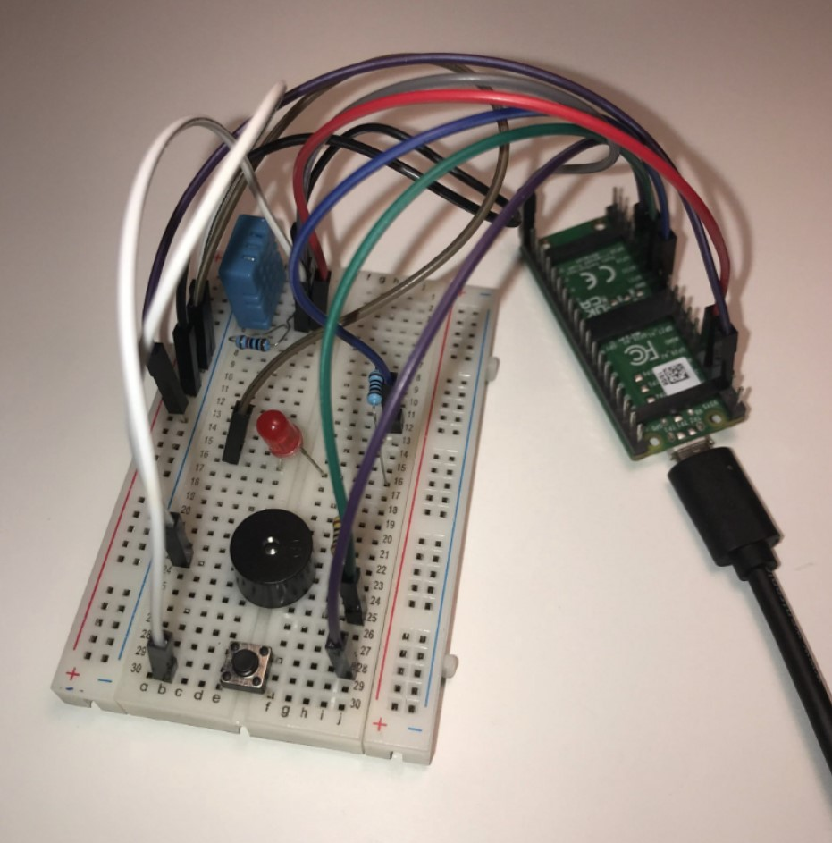

# freeRTOS Project

This project demonstrates and evaluates the use of a <strong>Real-Time Operating System (FreeRTOS)</strong> compared to <strong>MicroPython</strong> in a project with strict time constraints. It's done with a Raspberry Pi Pico which interacts with a DHT11 sensor, a buzzer, a button, and an LED in various tasks. 

## Project Description

The project uses the following components:
- **DHT11 sensor**: Measures temperature and humidity.
- **Buzzer and LED**: Act as an alarm.
- **Button**: Resets the alarm.
- **Two intensive tasks**: Simulate CPU-intensive processes.

The goal is to trigger the alarm when humidity exceeds 90%, which can be reset by pressing the button. The project also includes two tasks with nested loops to keep the program busy.

## Real-Time Requirements

The system should respond deterministically to changes in humidity and button presses, even when intensive tasks are running. This means:
- The sensor, alarm, and button should operate reliably regardless of CPU load.
- Task execution time should be consistent down to the millisecond.

## Conclusion

The project demonstrated the advantages of using an RTOS for real-time applications, with it's deterministic behavior and efficient task scheduling. FreeRTOS outperformed MicroPython in handling concurrent tasks and maintaining consistent execution times down to milliseconds. The MicroPython system often delayed alarm activation due to blocking by other intensive tasks.

